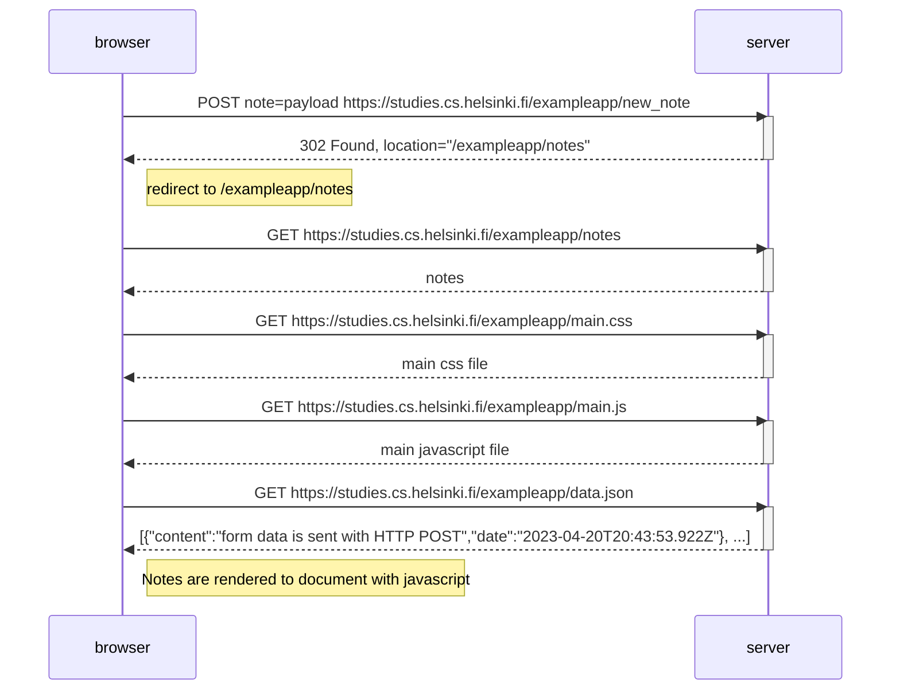

```mermaid
sequenceDiagram
    participant browser
    participant server
    
    browser->>server: POST note=payload https://studies.cs.helsinki.fi/exampleapp/new_note
    activate server
    server-->>browser: 302 Found, location="/exampleapp/notes"
    deactivate server
	
	Note right of browser: redirect to /exampleapp/notes
    
    browser->>server: GET https://studies.cs.helsinki.fi/exampleapp/notes
    activate server
    server-->>browser: notes
    deactivate server
	
    browser->>server: GET https://studies.cs.helsinki.fi/exampleapp/main.css
    activate server
    server-->>browser: main css file
    deactivate server
    
    browser->>server: GET https://studies.cs.helsinki.fi/exampleapp/main.js
    activate server
    server-->>browser: main javascript file
    deactivate server
        
    browser->>server: GET https://studies.cs.helsinki.fi/exampleapp/data.json
    activate server
    server-->>browser: [{"content":"form data is sent with HTTP POST","date":"2023-04-20T20:43:53.922Z"}, ...]
    deactivate server    

    Note right of browser: Notes are rendered to document with javascript
```