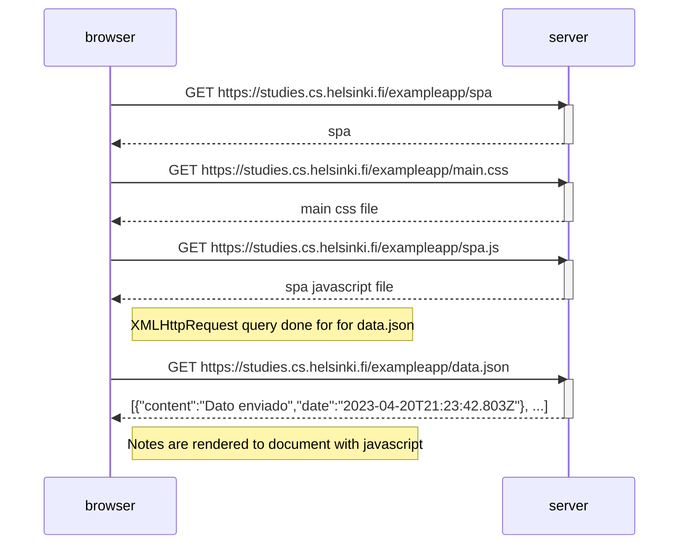

```mermaid
sequenceDiagram
    participant browser
    participant server
    
    browser->>server: GET https://studies.cs.helsinki.fi/exampleapp/spa
    activate server
    server-->>browser: spa
    deactivate server
	
    browser->>server: GET https://studies.cs.helsinki.fi/exampleapp/main.css
    activate server
    server-->>browser: main css file
    deactivate server
    
    browser->>server: GET https://studies.cs.helsinki.fi/exampleapp/spa.js
    activate server
    server-->>browser: spa javascript file
    deactivate server
	
	Note right of browser: XMLHttpRequest query done for for data.json 
        
    browser->>server: GET https://studies.cs.helsinki.fi/exampleapp/data.json
    activate server
    server-->>browser: [{"content":"Dato enviado","date":"2023-04-20T21:23:42.803Z"}, ...]
    deactivate server    

    Note right of browser: Notes are rendered to document with javascript
```